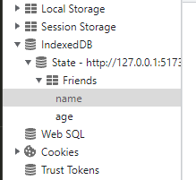

# 使用IndexedDB优化资源加载速度及状态持久化

## IndexedDB是什么?

IndexedDB是一个基于键值对的数据库，可以用来存储大量结构化数据。它可以用来缓存资源，以便在离线时使用。[mdn介绍](https://developer.mozilla.org/zh-CN/docs/Web/API/IndexedDB_API)

## 为什么使用IndexedDB

对比localStorage,sessionStorage,cookie等存储方式 IndexedDB有以下优势:

  * IndexedDB是异步的，不会阻塞主线程
  * IndexedDB可以存储大量数据，而且可以存储[结构化克隆算法](https://developer.mozilla.org/zh-CN/docs/Web/API/Web_Workers_API/Structured_clone_algorithm)
  * IndexedDB可以用来缓存资源，以便在离线时使用
  * IndexedDB可以用来存储用户的状态，以便在下次打开页面时恢复

|                  | localStorage     | sessionStorage   | cookie                  | IndexedDB                                                    |
| ---------------- | ---------------- | ---------------- | ----------------------- | ------------------------------------------------------------ |
| 有效期           | 永久有效         | 关闭浏览器清除   | 非持久化,刷新页面则刷新 | 永久有效                                                     |
| 存储容量         | 一般5MB          | 一般5MB          | 一般4KB                 | 无上限                                                       |
| 存储类型限制     | 可JSON序列化的值 | 可JSON序列化的值 | 可JSON序列化的值        | 存储[结构化克隆算法](https://developer.mozilla.org/zh-CN/docs/Web/API/Web_Workers_API/Structured_clone_algorithm)支持的任何对象 |
| 存取数据任务类型 | 同步             | 同步             | 同步                    | 异步,同步                                                    |
| 同域限制         | 是               | 是               | 是                      | 是                                                           |


## IndexedDB兼容性

### 兼容性
基本上所有现代浏览器都支持IndexedDB


### 调试
key为model中声明的主键

## IndexedDb框架
 mdn备注:IndexedDB API 是强大的，但对于简单的情况可能看起来太复杂。如果你更喜欢一个简单的 API，请尝试 localForage、dexie.js、PouchDB、idb、idb-keyval、JsStore 或者 lovefield 之类的库，这些库使 IndexedDB 对开发者来说更加友好。
 这里我们采用dexie.js进行开发


## dexie.js

[dexie.js](https://dexie.org/docs/Tutorial/Getting-started)是一个轻量级的IndexedDB封装库，它提供了一个简单的API来操作IndexedDB。dexie.js的API设计参考了jQuery的API设计，因此非常容易上手。
### 安装

yarn
```bash
yarn add dexie
```
npm
```bash
npm install dexie
```

### 创建数据库模型
在src/models目录下创建State.ts文件

```ts
import Dexie, { Table } from 'dexie';

export interface Friend {
  id?: number;
  name: string;
  age: number;
  headImg: string;
}

export class State extends Dexie {
  // friends 表类型声明
  Friends!: Table<Friend>;
  constructor() {
    super('State');
    // 若表结构改变需更改版本号
    this.version(1).stores({
      // 主键 id 自增, name,age作为索引 不要将文件,大字符串存储在索引中.如Friend.headImg
      Friends: '++id, name, age',
    });
  }
}

export const { Friends } = new State();

```
### 创建控制器
在src/controllers目录下创建State.ts文件

```ts
import { Friend, Friends } from "../models/State";

/**
 * @description 查询
 */
export async function getFriend(id:string){
  const friend = await Friends.get(id);
  return friend;
}

/**
 * @description 查询年龄为age的所有朋友
 */
export async function getFriendsByAge(age:number){
  const friends = await Friends.where("age").equals(age).toArray();
  return friends;
}

/**
 * @description 获取所有朋友
 */
export async function getAllFriends(){
  const friends = await Friends.toArray();
  return friends;
}

/**
 * @description 添加朋友
 */
export async function addFriend(data:Friend){
  const id = await Friends.add(data);
  return id;
}

/**
 * @description 更新朋友
 */
export async function updateFriend(data:Friend){
  const id = await Friends.put(data);
  return id;
}

/**
 * @description 删除朋友
 */
export async function deleteFriend(id:string){
  return await Friends.delete(id);
}
```
## 使用

在react 中使用
```tsx
import React, { useEffect, useState } from 'react';
import mock from 'mockjs';
import './App.css';
import { Button, Table, TableProps } from 'antd';
import { Friend } from './models/State';
import { addFriend, getAllFriends } from './controllers/State';
import img1 from './img/1.jpg';
import img2 from './img/2.jpg';

const App: React.FC<AppProps> = () => {
  const [dataSource, setDataSource] = useState<Friend[]>([]);
  const columns = [
    {
      title: 'id',
      dataIndex: 'id',
    },
    {
      title: '姓名',
      dataIndex: 'name',
    },
    {
      title: '年龄',
      dataIndex: 'age',
    },
    {
      title: '头像',
      dataIndex: 'headImg',
      render: (text: string) => (
        
      ),
    },
  ];
  useEffect(() => {
    request();
  }, []);
  async function request() {
    const res = await getAllFriends();
    setDataSource(res);
  }
  const tableConfig: TableProps<Friend> = {
    columns,
    dataSource,
    rowKey: 'id',
  };
  return (
    <div>
      <Table {...tableConfig}></Table>
      <Button
        onClick={async () => {
          const headImg = await imgToBase64(Math.random() > 0.5 ? img1 : img2);
          const data = mock.mock({
            name: '@cname',
            age: '@integer(18, 60)',
            headImg,
          });
          await addFriend(data);
          await request();
        }}>
        添加随机朋友
      </Button>
    </div>
  );
};

interface AppProps {}
export default App;
App.displayName = 'App';

async function imgToBase64(url: string) {
  const res = await fetch(url, {});
  const blob = await res.blob();
  return await blobToBase64(blob);
}
function blobToBase64(blob: Blob): Promise<string> {
  const reader = new FileReader();
  reader.readAsDataURL(blob);
  return new Promise((resolve) => {
    reader.onloadend = () => {
      resolve(reader.result as string);
    };
  });
}

```
效果图


每次点击添加按钮都会向数据库中添加一条数据,并且会重新渲染页面


## 创建工具类


```typescript
  /**
   * @description 清除缓存
   */
  static async clear() {
    try {
      await clearCache();
    } catch (error) {
      console.error(error);
      return;
    }
  }
```

export async function clearCache() {
  const caches = await ResourceCache.toArray();
  caches.forEach((cache) => {
    if (cache.expireTime) {
      const now = Date.now();
      const timestamp = cache.timestamp;
      if (now - timestamp > cache.expireTime) {
        ResourceCache.delete(cache.id!);
      }
    }
  });
}